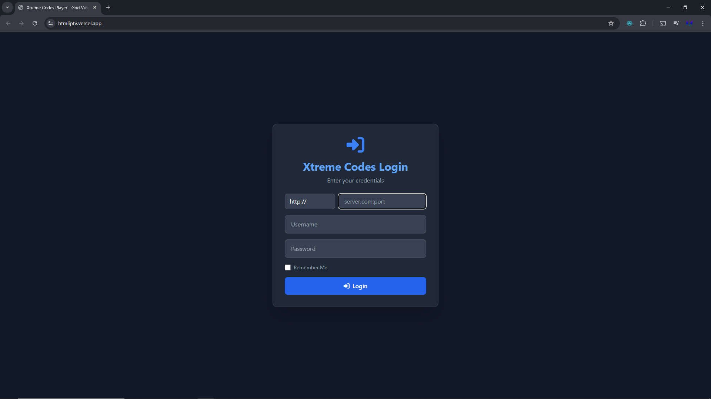

# 

# htmliptv

**A Simple, Single-File HTML IPTV Player with Favorites**

This is a lightweight and straightforward HTML file designed to provide basic IPTV functionality with Extreme Codes login and a favorites feature.  It's perfect for quickly accessing your IPTV service in a web browser without complex setups or installations.

**Key Features:**

* **Single HTML File:**  Everything you need is contained within a single `.html` file, making it incredibly portable and easy to use.
* **Extreme Codes Login:**  Built to support IPTV services that utilize Extreme Codes (Xtream Codes) login credentials.
* **Favorites Functionality:**  Allows you to save and quickly access your favorite IPTV channels for easy navigation.
* **Simple Setup:**  No installation required! Just open the HTML file in your web browser.
* **Local or Hosted:**  Run it directly from your computer by opening the `.html` file, or host it on a web server for wider access.

**How to Use:**

1. **Download/Create the HTML File:**  Obtain the `htmliptv.html` file (or create a new file and save the provided HTML code as `.html`).
2. **Add Your Extreme Codes Login:**  You will need to **edit the HTML file** to include your Extreme Codes login details (server URL, username, and password).  Look for comments within the HTML code indicating where to insert this information.
3. **Open in Your Browser:** Simply open the `.html` file in any modern web browser (Chrome, Firefox, Safari, Edge, etc.).
4. **Start Watching:** Once loaded, you should be able to log in using your Extreme Codes credentials and access your IPTV channels. Use the favorites feature to save your preferred channels.

**Customization:**

* **Styling:**  The HTML file can be easily customized with CSS to change the appearance and layout to your liking.
* **Functionality:**  While designed to be simple, you can extend the functionality by adding JavaScript to enhance features or integrate with other services (if you have the coding knowledge).

**Important Notes:**
* **Extreme Codes Compatibility:** This HTML file is specifically designed for IPTV services that use the Extreme Codes login system. It may not work with other IPTV login methods without modification.
* **Legality:**  Always use IPTV services in accordance with applicable laws and regulations in your region. This HTML file is just a tool and does not endorse or encourage illegal content consumption.

**Disclaimer:**

This HTML IPTV player is provided as is, for educational and personal use. The creator is not responsible for how you use it or the content you access through it. Use it responsibly and legally.

---

Enjoy your simple HTML IPTV player!
